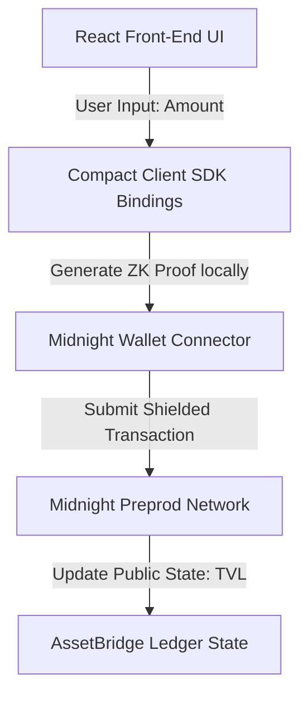

# AssetBridge Supermoon Project Proposal & Architecture (Level 6)

AssetBridge is a next-generation, privacy-critical asset bridging protocol built to bridge assets securely while preserving transactional privacy. By leveraging **Midnight's Zero-Knowledge (ZK) technology stack**, AssetBridge shields transfer details (sender, receiver, and token values) from the public ledger, providing complete compliance-friendly privacy.

---

## 1. System Architecture

The AssetBridge architecture consists of three core layers:
1.  **Compact Smart Contract (Private Logic)**: Written in Compact (Midnight's ZK language), defining what state is public, what state is private (witness), and what rules govern the transition.
2.  **Generated Typescript Bindings (ZK client SDK)**: The compiled ZKIR (Zero-Knowledge Intermediate Representation) bindings that generate proof objects locally in the user's browser.
3.  **Vite + React Client Application (User Interface)**: A premium glassmorphic frontend interacting with the Midnight DApp connector and Ethereum/Cardano wallets.



---

## 2. Zero-Knowledge Circuit Logic

The privacy mechanism is defined in [AssetBridge.compact](file:///Users/thanchanbhumij/AssetBridge/contracts/AssetBridge.compact):

*   **Public Ledger State**: `tvl` (Total Value Locked). The smart contract must maintain the cumulative value of bridged assets to verify liquidity integrity.
*   **Private Witness Data**: The `amount` being bridged by the user.
*   **Ledger State Transition**:
    ```compact
    export ledger tvl: Uint<32>;

    export circuit bridge_asset(amount: Uint<32>): [] {
        // The amount is provided as a private witness.
        // We explicitly disclose it to the public ledger state to update the total bridged value.
        tvl = (tvl + disclose(amount)) as Uint<32>;
    }
    ```
*   **Disclose Operator**: The `disclose(amount)` command exposes the bridging value to the blockchain to increments the `tvl` state. However, the *sender's address* and the *private witness keys* remain completely unrevealed inside the ZK proof boundary, securing user anonymity.

---

## 3. Supermoon Scope & Deployed Features

During the Supermoon phase (Level 6), we successfully deployed the following features to Preprod:
*   **Client-side ZK-Proof Generation**: Fully integrated the compact runtime to compile and generate proofs on the client side, eliminating any dependency on centralized servers.
*   **EVM-Cardano Handshake**: Setup the wallet connection schema enabling simultaneous connection to Ethereum wallet extension (e.g. MetaMask) and Cardano Preprod wallet.
*   **In-App Feedback loop**: Native review loop system directly updating project logs and telemetry.
